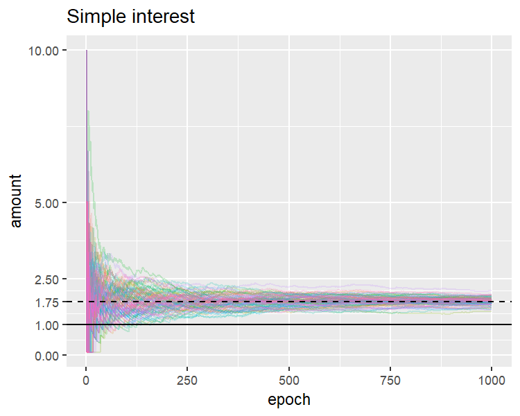
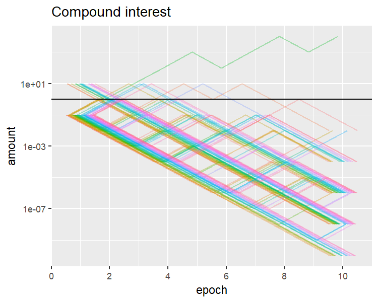
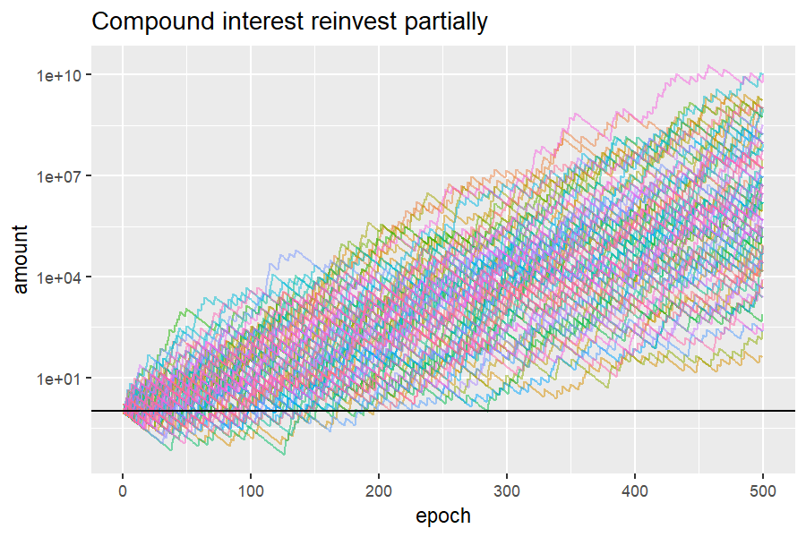

# 単利と複利

何かに投資して儲かるためには、投資対象から戻ってくる額の、算術平均の期待値が1を上回る必要があります。1を下回っていたら投資する価値はありません。

では一回投資をして、増えたか減ったかはともかく、その全額を再投資したらどうなるでしょうか。幾何平均の期待値が1を下回っていたら、再投資を繰り返すたびに減っていくことになります。

単純な例でシミュレーションしてみます。六面体のサイコロを振って、以下のようになると仮定しましょう。
* 1の目が出たら、投資額が10倍になって戻ってくる
* 2..6の目が出たら、投資額が0.1倍になって戻ってくる

算術平均は1.75倍、幾何平均(倍率の6乗根)は0.215です。

```r
(10.0 + 0.1 * 5) / 6.0
[1] 1.75
(10.0 * (0.1 ^ 5.0)) ^ (1.0 / 6.0)
[1] 0.2154435
```

算術平均=同額を一定回数投資する=単利、幾何平均=全額を再投資する=複利、としてシミュレーションしてみましょう。ここでは二択なので本当は二項分布で求まるのですが、サイコロをたくさん振って投資額の増減をみる、というのを[simple_compound_interest.R](scripts/interest/simple_compound_interest.R)で100系列行ってみます。





上段(同額を一定回数投資する)は算術平均の期待値に向かって緩やかに収束し、下段(全額を再投資する)は急速に0に近づいています。

実は、全額を再投資するのではなく、一定割合だけ再投資すると増えるようになります。再投資割合を0.075 (7.5%)にすると、幾何平均が1.028と1を超えます。

```r
r <- 0.075
(((1.0 - r) + r * 10.0) * (((1.0 - r) + r * 0.1) ^ 5.0)) ^ (1.0 / 6.0)
[1] 1.028118
```

これはいい感じですね。[compound_interest.R](scripts/interest/compound_interest.R)でシミュレーションしましょう。



ということで、期間が長ければ多くの場合はプラスになります。なおlog(1.75)/log(1.028118) = 20.2なので、20期間を超えると複利が単利を超えます。
