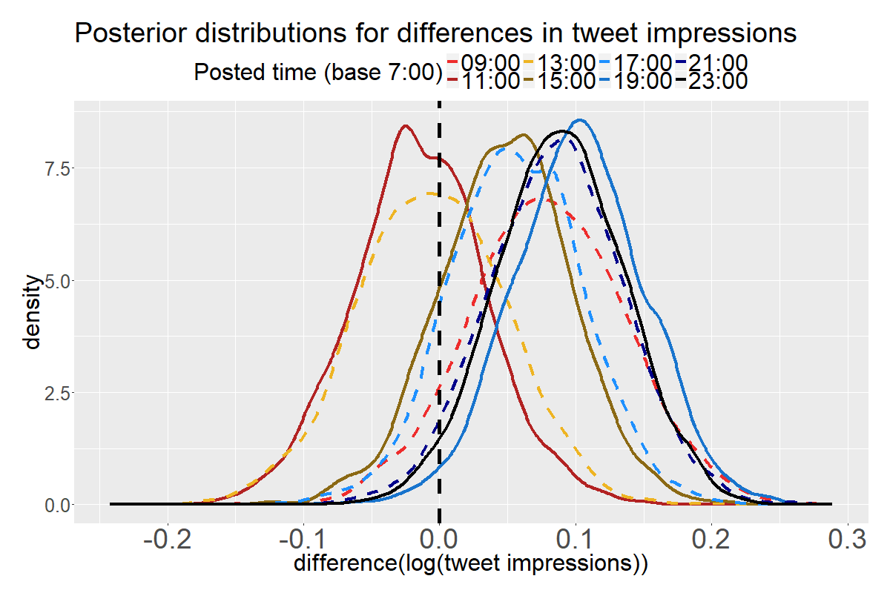

# Botの投稿時刻によるツイートインプレッションの差を測る

「やめるのだフェネックで学ぶC++ Bot」は、毎時7, 11, 15, 19, 23時に自動投稿します。投稿時刻によってツイートインプレッションの差が出るかどうかベイズ推定します。

## 前提

投稿するネタの順番はランダムで、一周するまでは同じものは二度出現しません。現在のところ[一覧](cppFriendsBot.txt)には500件以上ありますので、それより短い期間(100日間以内)であれば同じツイートは二度出現しません。

そこで、それぞれのツイートは内容に従った個別のインプレッションがあるが、それとは別に投稿時刻による差があるかどうかを推定します。つまりツイート内容に従ったインプレッションのばらつきは、十分たくさんのツイートがあれば一様になると仮定します。

ツイートインプレッションは、大半が対数正規分布に従うことが分かっています。後日で検証スクリプトを整備します。

## 投稿時刻による差を推定する

解析対象のデータは、ツイートアクティビティのデータをCSVエクスポートしたものです。今回は2018/1/7-2018/3/17の10週間(70日間)のツイートインプレッションを調べます。スクリプトの入出力ファイル名はまだ固定です。

* ツイートアクティビティのデータをCSVエクスポートします。曜日の影響を除くために、週単位がよいでしょう。今日から2,3日前までのツイートインプレッションは過少評価されているようですので除きます。
* CSVファイルを、analyze_tweet_activity_bayesian.py で前処理します。ツイート本文の絵文字のように、Rが解釈できそうもない文字を除くのと、botの投稿か中の人の投稿かを投稿時刻で見分ける、ということをしています。
* 同ディレクトリのanalyze_tweet_activity_bayesian.R + analyze_tweet_activity_bayesian.stan でRStanを実行します。

最後まで実行できると、以下のような画像が出ます。このグラフは、毎時11, 15, 19, 23時に自動投稿のツイートインプレッションが、7時のものよりどれだけ多いかという差の、事後確率分布です。差はツイートインプレッションの対数なので、何倍かということを意味します(1.0違うと実数で2.718倍違う)。夜(19, 23時)は朝7時よりもツイートインプレッションが多そうですね。

ちなみに2017/9/16-2017/12/15の三か月間は以下の通りです。当時は2時間おきに投稿していました。朝7時より他の時刻のツイートインプレッションが多い確率は減っています。

