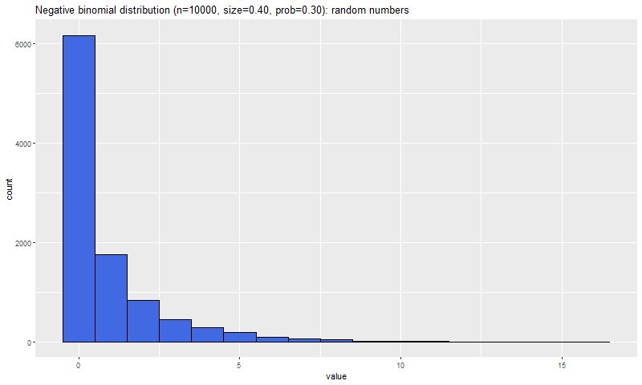

# C++で負の二項分布

## 標準C++ライブラリによる乱数生成

負の二項分布に基づく乱数を生成する。

```cpp
std::negative_binomial_distribution<int> dist(size, prob);
```

テンプレートパラメータの型は整数型でなければならない。そのため以下は標準C++ヘッダのstatic_assertでエラーになる。

```cpp
std::negative_binomial_distribution<double> dist(size, prob);
```

probはdoubleだが、sizeは整数に限る。

## Boost 標準C++ライブラリによる確率密度

負の二項分布に基づく確率密度を生成する。size, probとも浮動小数を指定できる(省略時はdouble)。

```cpp
boost::math::negative_binomial dist(size, prob);
boost::math::cdf(dist, p);
```

## Boost 標準C++ライブラリによる乱数生成

標準C++と同様である。

```cpp
boost::random::negative_binomial_distribution<int, double> dist(size, prob);
```

テンプレートパラメータの最初の型は整数型でなければならない。浮動小数を指定するとコンパイルエラーになる。

```cpp
boost::random::negative_binomial_distribution<double, double> dist(size, prob);
```

さてsizeがdoubleの場合、intに変換されて呼び出される(g++なら-Wconversionオプションで警告が出る)。intに変換した結果が0だと、runtime assertionが出る。

```text
assertion "_alpha > result_type(0)" failed: file "/usr/include/boost/random/gamma_distribution.hpp", line 117, function: boost::random::gamma_distribution<RealType>::gamma_distribution(const result_type&, const result_type&) [with RealType = double; boost::random::gamma_distribution<RealType>::result_type = double]
```

Rのrnbinomを使うと、size<1でも乱数を生成できる


